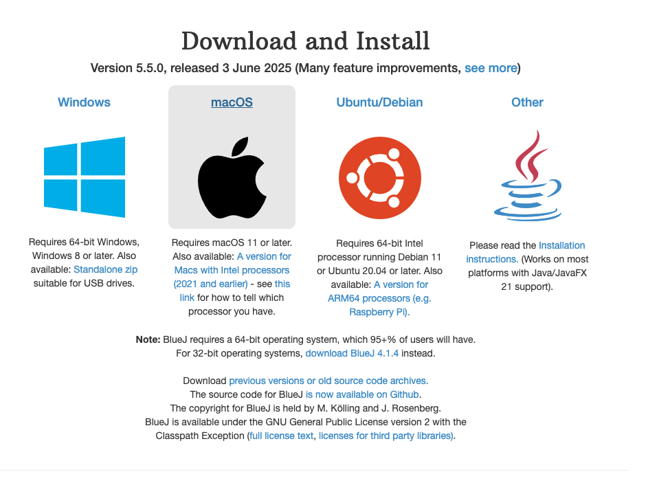

# Installing BlueJ Development Environment - Windows

- If you are using your own laptop and would like to install Bluej on it, please follow the instructions in this step.
- If you are using the SETU computers, you can ignore this step and move onto the next step.

## Downloading BlueJ for Windows

- Bluej can be downloaded from 
https://www.bluej.org/ . It is free.

- Scroll down and you will see the following suite of download options:   

- Choose the version of BlueJ that you would like to install.

- For Windows users you can follow the instructions on the screen. If you need more  help, you can watch this video from the BlueJ website: [here](https://youtu.be/so8_fCKTlFo?si=uVaccVBlzIW6tdk_). 

Any problems, contact us by Slack or in class. 

