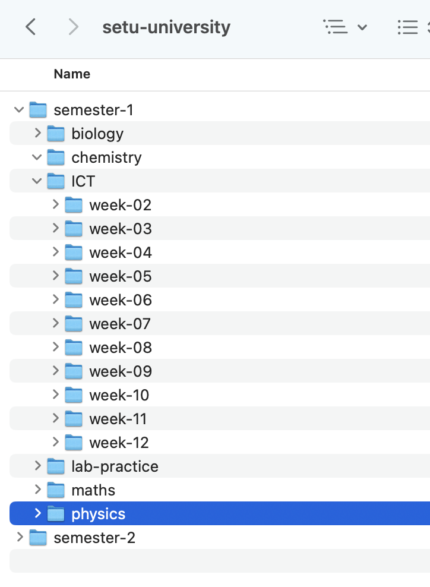

# Filing System

Watch the video here 

1. Decide where you want to store your files.

2. Set up a filing system that has this or a similar structure:

3. When this is done, upload a screenshot of your filing system to the dropbox on Moodle called 'Filing System Exercise'.