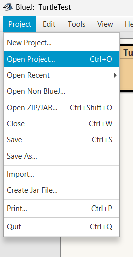
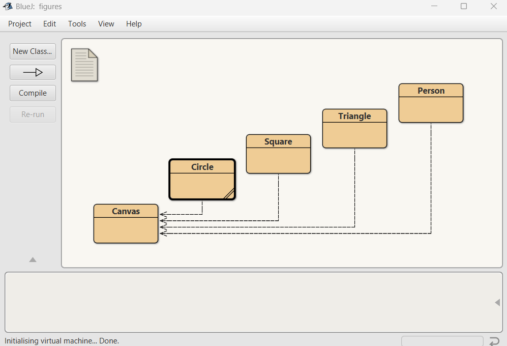
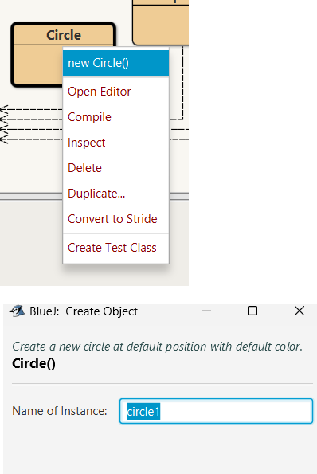
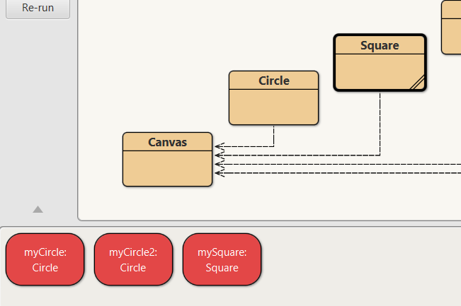

# Getting Started

- Download the sample project [Figures](archives/figures.zip). 
- Extract it and note where you have saved it to (you can use your OneDrive)
- Open BlueJ
- On the Toolbar go to Projects -> Open Projects
    
- Find where you saved the figures project and open it
- It should look like this (if not ask!)
    

## Lets create some objects
- We Right-click on a class (e.g., Circle, Square, Triangle) to create an object.
    - So right-click on Circle and choose **new Circle**  
          
    - You will be asked to name it, call it **myCircle**
         
    

**Congratulations** you have created your first object.

**Exercise 1** - Now, create another circle object and another square object
 