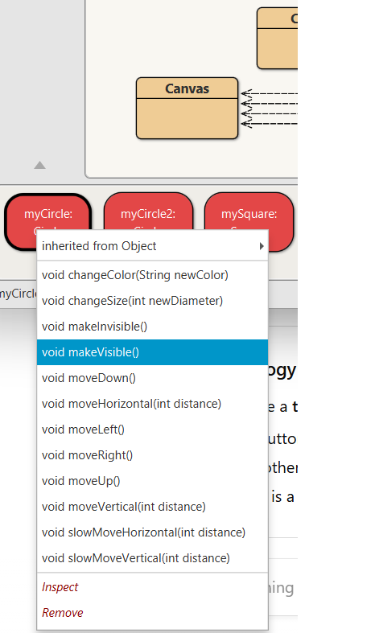

# Calling Methods 

## What are Methods?

A method is like a set of instructions that an object can follow.

Think of it as a command you can give to an object.

Each method has a name (like makeVisible() or moveRight()) that tells you what it does.

- Right-click on one of the circle objects (not the class, remember the difference!), you will see a pop-up menu with several operations
- Choose makeVisible() from the menu - **what happens??**
 

You will notice other methods that can be **invoked** on the Circle object - try them:

e.g.

makeVisible() → shows the circle on the screen.

moveRight() → moves the circle to the right.

changeColor("blue") → changes the circle’s color to blue.

**In our Figures example:**

The shapes (Circle, Square, Triangle) are **objects**.

The things they can do (move, change color, resize) are **methods**.

**Exercise 2** - What happens if you call moveDown() twice?  Or three times? What happens if you call changeColor("blue")
